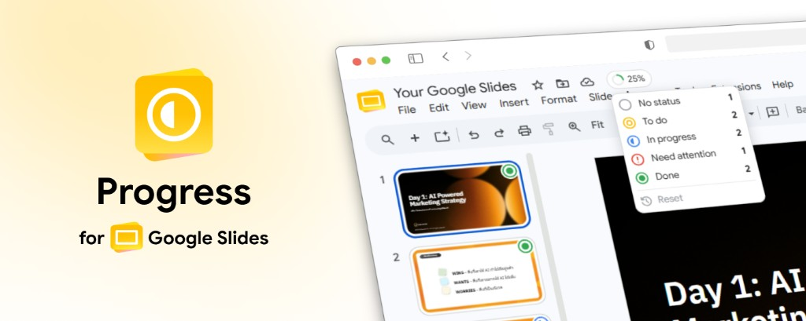

# Progress for Google Slides



**[Install from Chrome Web Store](https://chromewebstore.google.com/detail/mgebbidbnfnomiilkimbiplmkafccmpf)**

A Chrome extension for Google Slides that lets you assign slide statuses from the filmstrip, track overall completion in the title bar, and sync statuses with collaborators via hidden marker shapes on each slide. Customize the status preset (icon, color, label, order, add/remove) from the side panel; presets and collaborator emails sync through Google Drive file metadata on the presentation.

Built with [WXT](https://wxt.dev) and Manifest V3.

## Features

- Status chip on every filmstrip thumbnail
- Popover dropdown to pick a status (native Popover API + CSS anchor positioning)
- Title-bar progress badge showing completion percentage
- Hover breakdown of counts per status, with a control to reset all slides to No status
- Side panel (opens from the toolbar icon) with:
  - Status history for the active slide
  - Customizable status presets (icon, color, label, order, add/remove; which statuses count as complete)
  - Account view for sync status, last synced time, sign-in, and sign-out
- Local cache for instant UI
- Optional collaborator sync through the Google Slides API and Drive file metadata (requires sign-in), with background `chrome.alarms` polling

## Development

```bash
npm install
npm run dev
```

WXT dev mode writes to `.output/chrome-mv3-dev`. That folder does **not** include `content_scripts` in the manifest — the background service worker registers them at runtime over a WebSocket to `localhost:3000`. Keep `npm run dev` running, then reload the extension and refresh any open Google Slides tabs.

For standalone unpacked testing (no dev server), use a local build with a stable extension ID:

```bash
npm run build:local
```

Load the unpacked extension from `.output/chrome-mv3-dev`.

Production builds (`npm run build`) write to `.output/chrome-mv3` and also include the public key from `extension.pub.b64`, so the unpacked ID matches the Chrome Web Store listing.

## Stable extension ID (OAuth)

Generate a stable key pair once so your unpacked extension ID does not change between reloads:

```bash
npm run generate-extension-key
```

This creates `extension.pub.b64` (commit this) and `extension.pem` (private, gitignored). The script prints your extension ID — register it in Google Cloud as a **Chrome extension** OAuth client.

This repository already includes the Chrome Web Store public key in `extension.pub.b64`, which resolves to extension ID `mgebbidbnfnomiilkimbiplmkafccmpf`.

## Google Cloud OAuth setup

1. Create a Google Cloud project and enable **Google Slides API**, **Google Drive API**, and **Google Picker API**
2. Configure the OAuth consent screen (Testing mode is fine for development). Add `drive.file`, `userinfo.email`, and `userinfo.profile`. Do not keep `presentations` or `drive.metadata` unless Google already approved them.
3. Run `npm run generate-extension-key` and note the extension ID (or use the store ID above)
4. Create an OAuth client of type **Chrome extension** with that item ID
5. (Optional) For a simpler “allow this presentation” dialog instead of the hosted Picker page, also create a **Web application** OAuth client in the same project. Add `https://mgebbidbnfnomiilkimbiplmkafccmpf.chromiumapp.org/` as an authorized redirect URI (use your extension ID if it differs). Set `WXT_OAUTH_WEB_CLIENT_ID` to that web client’s ID. **Do not** reuse the Chrome extension client ID here — `launchWebAuthFlow` requires a web client, and using the extension client causes `redirect_uri_mismatch`.
6. Export the client ID when running WXT, plus a browser API key and Cloud **project number** for Google Picker:

```bash
# macOS / Linux
export WXT_OAUTH_CLIENT_ID="YOUR_CLIENT_ID.apps.googleusercontent.com"
export WXT_GOOGLE_API_KEY="YOUR_BROWSER_API_KEY"
export WXT_GOOGLE_APP_ID="YOUR_CLOUD_PROJECT_NUMBER"

# Windows PowerShell
$env:WXT_OAUTH_CLIENT_ID="YOUR_CLIENT_ID.apps.googleusercontent.com"
$env:WXT_GOOGLE_API_KEY="YOUR_BROWSER_API_KEY"
$env:WXT_GOOGLE_APP_ID="YOUR_CLOUD_PROJECT_NUMBER"

npm run dev
```

You can also copy `.env.example` to `.env.local` and set `WXT_OAUTH_CLIENT_ID`, `WXT_GOOGLE_API_KEY`, and `WXT_GOOGLE_APP_ID` there.

Enable **Google Slides API**, **Google Drive API**, and **Google Picker API**. Create a browser API key restricted to `https://progress.teerakit.com/*`. The confirmation page lives at `docs/picker.html` and is served from GitHub Pages at `progress.teerakit.com`.

After publishing to the Chrome Web Store, update the OAuth client with the store-assigned extension ID.

The `drive.file` scope allows access only to presentations you confirm (the open deck, once per file). The Extension then reads slide page IDs, writes small hidden marker shapes, and reads/writes Drive `appProperties` on that file. The `userinfo.email` and `userinfo.profile` scopes identify the signed-in user for status history attribution; profile photos stay in local cache. See `CHROMEWEBSTORE.md` for listing metadata and permission justifications.

## Build

```bash
npm run build
npm run zip
```

## Permissions

- `storage` — local slide status cache
- `identity` — Google sign-in for Slides and Drive sync
- `alarms` — periodic background sync for open presentations (1 minute)
- `sidePanel` — History, Statuses, and Account UI; opens when you click the toolbar icon
- `https://docs.google.com/*` — find open Google Slides tabs so chips, presets, and the side panel stay in sync
- `https://slides.googleapis.com/*` — read slide structure and write status marker shapes
- `https://www.googleapis.com/drive/v3/*` — read and write status preset and collaborator email metadata
- `https://www.googleapis.com/oauth2/v3/*` — fetch the signed-in user's email and profile photo

## Website

https://progress.teerakit.com/

GitHub Pages is served from the `docs/` folder. In the repository settings, set Pages to deploy from branch `main`, folder `/docs`.

Chrome Web Store: https://chromewebstore.google.com/detail/mgebbidbnfnomiilkimbiplmkafccmpf

## Support

If you find Progress useful, you can [sponsor the project on GitHub](https://github.com/sponsors/cteerakit).

## Legal

- [Privacy Policy](PRIVACY.md)
- [Terms of Service](TERMS.md)

## License

MIT — see [LICENSE](LICENSE).
